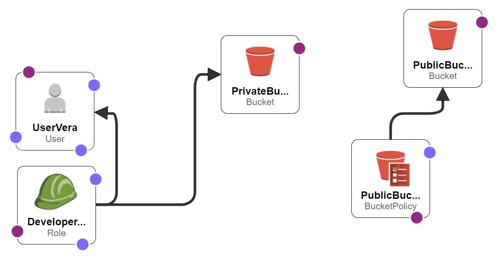

# CloudFormation

AWS CloudFormation is a service that helps you to set up AWS resources and managing. Create a template that describes all the AWS resources that you want (like Amazon EC2 instances or Amazon RDS DB instances), and CloudFormation takes care of provisioning and configuring those resources for us. you don't need to individually create and configure AWS resources and figure out what's dependent on what; CloudFormation handles that.

# Templates

A CloudFormation template is a JSON or YAML formatted text file. you can save these files with any extension, such as `.json`, `.yaml`, `.template`, or `.txt`. CloudFormation uses these templates as blueprints for building our AWS resources. For example, in a template, you can describe an Amazon EC2 instance, such as the instance type, the AMI ID, block device mappings, and its Amazon EC2 key pair name. Whenever you create a stack, you also specify a template that CloudFormation uses to create whatever you described in the template.

# Stacks

When you use CloudFormation, you manage related resources as a single unit called a stack. You create, update, and delete a collection of resources by creating, updating, and deleting stacks. All the resources in a stack are defined by the stack's CloudFormation template.

# Tasks

- Instantiate a pair of s3 buckets

The following code describe how to created a two buckets, one is public and another one is private using CloudFormation.

```bash
"Resources": {
    "PublicBucket": {
        "Type": "AWS::S3::Bucket",
        "Properties": {
            "BucketName": "public-bucket-ml-01",
            "PublicAccessBlockConfiguration": {
                "BlockPublicAcls": false,
                "BlockPublicPolicy": false,
                "IgnorePublicAcls": false,
                "RestrictPublicBuckets": false
                },
                "Tags": [
                    {
                        "Key": "Name",
                        "Value": "Public Bucket"
                    }
                ]
            }
        },
    "PrivateBucket": {
        "Type": "AWS::S3::Bucket",
        "Properties": {
            "BucketName": "private-bucket-ml-01",
            "Tags": [
                {
                    "Key": "Name",
                    "Value": "Private Bucket"
                }
            ]
            }
        }


    }
```

- Create a new user named `vera`

```bash
"UserVera": {
    "Type": "AWS::IAM::User",
        "Properties": {
            "UserName": "vera"
        }
    }
```

Refer the [cloudFormationTemp.template](cloudFormationTemp.template) for other task implementations.

Finally, the CloudFormation challenge looks as follows


