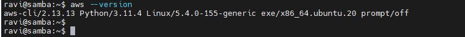

# AWSCLI

AWS Command Line Interface (AWS CLI) is a unified command-line tool provided by Amazon Web Services (AWS) that allows you to manage your AWS services and resources directly from the command line. With the AWS CLI, you can interact with various AWS services, automate tasks, and manage infrastructure using scripts and commands.

# Install AWSCLI in Linux OS

- The following command installs the AWS CLI on a Linux operating system

```bash
curl "https://awscli.amazonaws.com/awscli-exe-linux-x86_64.zip" -o "awscliv2.zip"
unzip awscliv2.zip
sudo ./aws/install
```

- Confirm the installation with the following command.

```bash
aws --version
```



# Tasks

- Show the contents of the hypothetical s3 bucket Important Data/logs

The following command is used to display the contents of the S3 bucket:

```bash
aws s3 ls s3://<<BUCKET_NAME>> --recursive
```

- Change the name of an IAM user

```bash
aws iam update-user --user-name <<EXISTING_USER_NAME>> \
--new-user-name <<NEW_USER_NAME>>
```

- Add the caller's IP address to a hypothetical security group sg_3452925

```bash
aws ec2 authorize-security-group-ingress \
         --group-id <<SECURITY_GROUP_ID>> \
         --protocol tcp --port <<PORT>> \
         --cidr <<CALLERS_ID>>/32
```

- Instantiate a new policy and attach it to the hypothetical role developer_level2

  - First, create a policy and attach it to role called `developer_level2`

  - To create a policy, first, generate a policy using the [AWS Policy Generator](https://awspolicygen.s3.amazonaws.com/policygen.html) and save the generated policy into a file called [policy.json](policy.json) or you can directly pass the policy to the `awscli` command.

  * The following command describes how to create a policy from the [policy.json](policy.json) file

  ```bash
  aws iam create-policy \
    --policy-name <<PolicyName>> \
    --policy-document file://policy.json
  ```

  - Finally, attach it to role called `developer_level2`

  ```bash
  aws iam attach-role-policy --policy-arn $policy_arn --role-name developer_level2
  ```
