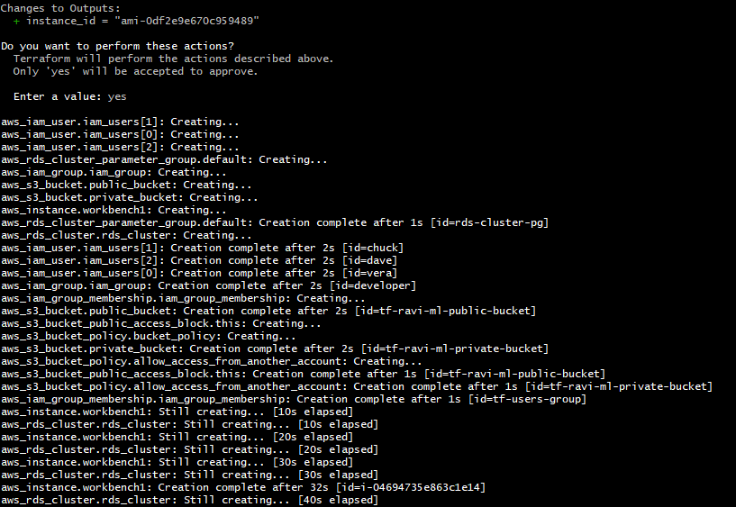

# Terraform

Terraform is an infrastructure as code (IaC) tool that lets you build, change, and version infrastructure safely and efficiently. This includes low-level components like compute instances, storage, and networking; and high-level components like DNS entries and SaaS features.

# Problem Statement:

Please create a Terraform (written in HCL) configuration to create and maintain the following resources:

- A t2.micro EC2 instance, named workbench1, based on an amazon machine image.
- A RDS Cluster with 2 nodes, each in different availability zone, with a max number of simultaneous connections equal to 16,000 connections.
- A pair of buckets, one pubic, one private with access to one external account with the account id: 001234567890
- An IAM group containing 3 IAM users: vera, chuck and dave

# Code Structure

```bash
├── main.tf
├── outputs.tf
├── providers.tf
├── Readme.md
└── variables.tf
```

# Terraform workflow

- Execute the following command to initializing a terraform configuration directory downloads and installs the providers defined in the configuration.

```bash
terraform init
```

- Execute the following command to validate the terraform configurations

```bash
terraform validate
```


- Execute the following command to format the terraform configurations

```bash
terraform fmt
```


- Execute the following terraform plan command it will display the what are the resources are provision and destory

```bash
terraform plan
```

- Execute the following command to provision real infrastructure

```bash
terraform apply
```



- Execute the following command to destroy all provisioned resources

```bash
terraform destroy
```


